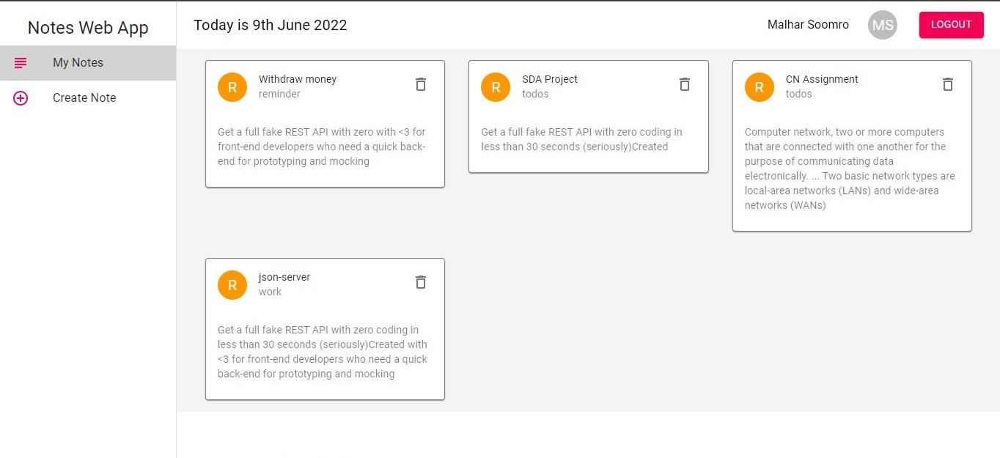

# Full Stack Notes Web App

### _Notes Web Application, where you can add, delete and store your private notes, only you can view and delete your private notes._

### Link : https://full-stack-notes-app-dev.web.app

## Desktop Interface

## Run Locally

- Run this command `git clone https://github.com/Malhar-Soomro/FullStack-Notes-App.git`

- You are now in the dev environment and you can play around.

## Features

- Authentication (Login/Signup) with Firebase
- Create and Delete your personal notes
- Store notes in Firestore(database)
- View only your personal notes
- Validation
- no one can see your personal notes

## Tech Stack

- HTML5
- CSS3
- Javascript and ES+6
- ReactJs
- Redux, Redux-Thunk
- Material-UI
- Tailwind Css
- Firebase(for authentication)
- Firebase(for database)
- Firebase (for hosting)
- formik(for validation)
- sweetalert2(for beautiful alerts)
